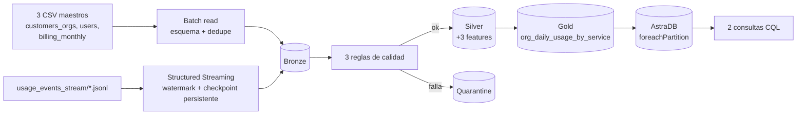

# Segundo Parcial — MVP Técnico: Cloud Provider Analytics

End-to-end mínimo: **Landing → Bronze (batch + streaming) → Silver → Gold → Serving (AstraDB/Cassandra)**, con PySpark en Google Colab y Structured Streaming.

> Este repo es la entrega del **MVP del segundo parcial** — alcance reducido a propósito. El proyecto completo (7 maestros, 5 marts, 5 tablas en Cassandra) vive en un repositorio separado: [Mineria-2-cloud-provider-analytics](https://github.com/dirre44/Mineria-2-cloud-provider-analytics).

## Arquitectura

Ver diagrama y justificación completa en [DECISIONS.md](DECISIONS.md). Resumen: patrón **Lambda** — batch (CSV de maestros) y streaming (eventos de uso) ingestan por caminos separados a Bronze, y de ahí en adelante el procesamiento es unificado.

## Quickstart

1. **Dataset**: tener a mano `cloud_provider_challenge_dataset_v1.zip`.
2. **AstraDB**: crear el keyspace y la tabla corriendo [docs/astra_schema_mvp.cql](docs/astra_schema_mvp.cql) en la CQL Console de una base de Astra existente (o nueva). Tener a mano el **Secure Connect Bundle** (.zip) y un **Application Token**.
3. Abrir [notebooks/00_mvp_pipeline.ipynb](notebooks/00_mvp_pipeline.ipynb) en Google Colab.
4. Correr las celdas **en orden, de arriba hacia abajo**, una sola vez por sesión:
   - Te va a pedir subir el dataset (`.zip`) la primera vez.
   - Te va a pedir subir el Secure Connect Bundle y pegar el token (con campo oculto) antes de la sección 5.
5. Todo el datalake (`landing/` → `gold/`) y el checkpoint de streaming persisten en `MyDrive/Segundo parcial mineria/`.

## Qué hace cada sección del notebook

| # | Sección | Evidencia que vas a ver |
|---|---|---|
| 1 | Batch → Bronze (3 maestros) | Conteos por tabla, deduplicados |
| 2 | Streaming → Bronze | Watermark + **dos corridas del stream**: la 2da debe leer 0 filas (checkpoint funcionando) |
| 3 | Silver + calidad | 3 reglas activas, muestras de quarantine (reales o de la prueba unitaria incluida) |
| 4 | Gold | Mart `org_daily_usage_by_service` |
| 5 | Serving AstraDB | Carga vía `foreachPartition` (no pandas), conteo en Cassandra |
| 6 | Idempotencia + evidencias | Conteos antes/después de recargar, rutas y tamaños de particiones |
| 7 | Consultas CQL | 2 queries de demo con resultados |

## Checklist de criterios de aceptación

- [x] Batch y streaming corren con los datos provistos.
- [x] Reglas de calidad y quarantine efectivas (con ejemplos, reales o de prueba unitaria).
- [x] Mart FinOps en Gold + tabla en Cassandra poblada.
- [x] 2 consultas sobre AstraDB con resultados.
- [x] Reprocesar no duplica (idempotencia verificada con conteos antes/después).
